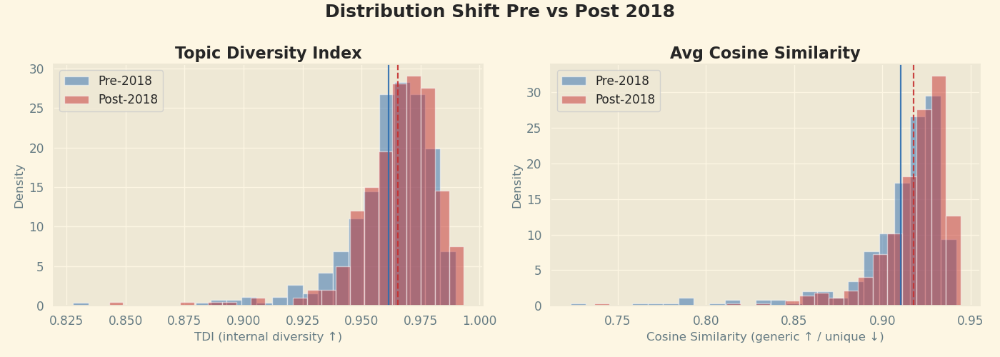

# cinema-narrative-shift

**Did TikTok make movie dialogue more repetitive? Testing a 2018 structural break in 746 film subtitles with SBERT sentence embeddings.**

TikTok reached mainstream adoption in Western markets around 2018. The
hypothesis: if shortened attention spans reshaped mainstream screenwriting,
films released after that point should read as more narratively repetitive
and thematically narrower than what came before. This project tests that
directly on the text — subtitles for 746 films released 2003–2025 — rather
than on box-office or survey proxies.



## What was done

Subtitles were pulled from the OpenSubtitles API (English, sorted by download
count, ~25–50 films per year) and matched to TMDb/OMDb/IMDb metadata by IMDb
ID. `parse_srt()` strips timestamps, subtitle indices, HTML tags, sound and
music cues, and speaker labels, leaving one clean dialogue string per film.
Four films with empty parses were dropped; after further filtering (below),
the final analysis sample is 746 films.

Every sentence (split on `.!?`, filtered to >3 words) was embedded with
**SBERT `all-MiniLM-L6-v2`**. This step targeted a PySpark/Dataproc cluster
on GCP: the intended distributed `pandas_udf` embedding pass failed because
worker nodes couldn't load SBERT into their local Hugging Face cache, so
embedding was run on the master node instead, in 200k-sentence chunks
checkpointed to GCS as it went (documented, with the failed attempt left
in place, in `notebooks/NB01_sbert_embedding.ipynb`).

The resulting sentence embeddings (1,121,360 rows) were loaded into
BigQuery and filtered to informative dialogue — at least 3 words and
10 characters, no symbol-heavy or purely numeric lines — leaving 795,119
rows (70.9%) aggregated into two film-level metrics:

- **Mean cosine similarity** — each film's mean sentence embedding compared
  against every other film's, i.e. how "generic" a film's language is
  relative to the corpus. Mean **0.9133**, range **0.7233–0.9443** across
  746 films. The most generic scripts by this measure are big franchise
  entries (*Fast & Furious Presents: Hobbs & Shaw*, *Thunderbolts*,
  *Avengers: Endgame*).
- **Topic Diversity Index (TDI)** — up to 500 sentences per film (364,254
  sentences total) clustered with `MiniBatchKMeans`, sweeping K=10–30 and
  picking K=15 by silhouette score, then the normalized Shannon entropy of
  each film's topic distribution. Mean **0.9634**, range **0.8277–0.9931**.
  Highest TDI (topics spread widest): *Zombieland: Double Tap*,
  *Thunderbolts*, *Nope*. Lowest: *The Great Wall*, *Greyhound*.

`notebooks/NB03_eda.ipynb` joins in IMDb ratings/genres/runtime and OMDb age
certification and box office, splits the corpus at 2018, and produces the
11 figures in `outputs/`. `notebooks/NB04_regression.ipynb` then regresses both
metrics (and `averageRating`, as a check) on release year, runtime,
dialogue volume, log(votes), box office, genre and age-certification
dummies.

**The result does not support the original hypothesis.** The `startYear`
coefficient is positive and significant in both OLS models — films have
become *more* generic in language (mean cosine similarity increasing with
year, coef ≈0.0152 in standardized units, p≈0.019) **and** *more* topically
diverse (TDI increasing with year, coef ≈0.0004, p≈0.004), holding genre,
age certification, runtime, dialogue volume, votes and box office constant.
There is no evidence of increased repetition or thematic narrowing after
2018; if anything the corpus drifts toward scripts that are simultaneously
more linguistically conventional and slightly more topically varied — read
as evidence against a TikTok-driven narrowing of mainstream screenwriting,
not for it.

## Layout

```
.
├── notebooks/
│   ├── NB00_collection_preprocessing.ipynb   OpenSubtitles/TMDb collection, SRT cleaning
│   ├── NB01_sbert_embedding.ipynb            SBERT sentence embeddings (PySpark/GCP Dataproc)
│   ├── NB02_feature_extraction.ipynb         BigQuery aggregation → cosine similarity + TDI
│   ├── NB03_eda.ipynb                        IMDb/OMDb join, pre/post-2018 EDA, the 11 output figures
│   └── NB04_regression.ipynb                 OLS regressions of both metrics on year, genre, etc.
├── outputs/                                  the 11 saved figures (*.png)
├── docs/
│   ├── ST446 PS3 Report.pdf                  full written report (methodology, related work, results)
│   └── README.abstract.bak                   the original write-up's abstract
├── README.md
└── requirements.txt
```

## Reproducing it

The notebooks are numbered in run order, but **only `NB00` runs as a
self-contained local job.** From `NB01` onward the code targets the
authors' own cloud environment, not a portable pipeline:

- `NB01` and `NB02` assume a PySpark session, a specific GCS bucket
  (`gs://bucket-ps3`), and a specific BigQuery table
  (`delta-compass-485215-a1.embeddings_ds.sentence_emb`).
- `NB03` and `NB04` read from hardcoded local/GCS paths under
  `home/MoviesLSE/...` and `gs://moviesbucket-cam/...`.

To rerun anything past `NB00`, you'll need your own GCP project (BigQuery +
GCS) and to repoint those path/project constants at it — the notebooks
document each step but aren't parameterised for a different environment.

```bash
pip install -r requirements.txt
jupyter execute notebooks/NB00_collection_preprocessing.ipynb   # needs your own OpenSubtitles + TMDb API keys
```

## Data

Subtitles come from OpenSubtitles, metadata from TMDb, IMDb and OMDb. None
of it is redistributed here — `outputs/` holds only the resulting figures,
and `data/` is git-ignored. `NB00` documents the collection step well enough
to rebuild the corpus with your own API credentials.

## Context

Team project (Transpacific Big Data Alliance) for LSE's course on
distributed computing for big data — the filename `docs/ST446 PS3 Report.pdf`
identifies it as ST446, submitted as problem set 3. The full write-up,
including related work and a fuller discussion of the regression results,
is in that PDF.
